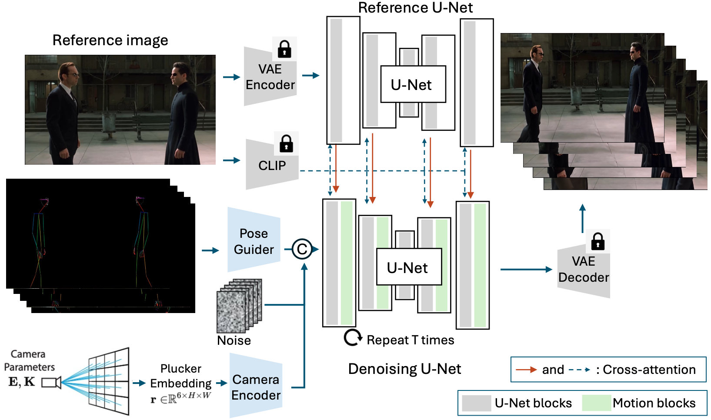

## HumanVid: Demystifying Training Data for Camera-controllable Human Image Animation [NeurIPS D&B Track 2024]
<div align='Center'>
    <a href='https://humanvid.github.io/'></a>
    <a href='https://arxiv.org/abs/2407.17438'></a>
</div>

# Framework



# News
- **`2024/10/20`**: The UE synthetic video part of HumanVid is released. Please download the videos, human poses and camera parameters from [here](https://mycuhk-my.sharepoint.com/:f:/g/personal/1155189552_link_cuhk_edu_hk/EoLw3qmoeFFEq88f87TZRfkB6w7FWFsnfeedfu52wk1rgw?e=yYH0n1), password `humanvid_ue`.
- **`2024/09/27`**: Our paper is accepted by NeurIPS D&B Track 2024.
- **`2024/09/02`**: The Internet video part of HumanVid is released. Please download the video urls and camera parameters from [here](https://drive.google.com/drive/folders/1UGEkOKXYX9BGUFz0ao6lOGXkZjQGoJcZ?usp=sharing). 

# Video Data

## Pexels videos
The pexels video data is collected from the Internet and we cannot redistribute them. We provide the video urls and camera parameters for each video. The camera parameters are stored in the `camera.zip` in the Google Drive. The videos could be downloaded by scripts from urls.

**Updates:** The video urls in Pexels.com are changed by the website team. We have updated the video urls in the txt file ending with `new`. Please use the new urls for downloading the videos.

## Unreal Engine rendered videos
The videos are in the OneDrive link. The videos are seperated in `3d` and `hdri`, indicating that the videos are rendered with 3D scene asset or HDRI image scene.


# Camera Trajectory Format
We follow [Droid-SLAM](https://github.com/princeton-vl/DROID-SLAM) and [DPVO](https://github.com/princeton-vl/DPVO) use [TUM Camera Format](https://cvg.cit.tum.de/data/datasets/rgbd-dataset/file_formats) 'timestamp tx ty tz qx qy qz qw' format for camera trajectory. The timestamp is number of frame. The tx, ty, tz are the translation of the camera in meters. The qx, qy, qz, qw are the quaternion of the camera rotation. For camera intrinsics, assuming the camera has a standard 36mm CMOS, we heuristically set the focal length to 50mm (horizontal) and 75mm (vertical) and the principal point to the center of the image, based on the observation on Internet videos. We empirically find that it works well.

For Unreal Engine rendered videos, we provide the camera parameters in the `ue_camera.zip` file. The format is 'timestamp tx ty tz qx qy qz qw fx fy scale', which is the same as the TUM format. The fx and fy are the normalized focal lengths. The scale is the scale factor for camera translations.

To better understand our camera parameter processing scripts (e.g., modifications over CameraCtrl), the camera processing code is in `src/dataset/img_dataset.py`. The complete code will be released later.


# Human Pose Extraction
Please refer to the `DWPose` folder for scripts of extracting and visualizing whole-body poses. Note that I have added a little modification on foot by also visualizing the keypoints on the foot. It also contains the keypoints convertion from SMPL-X to COCO Keypoints format. For pretrained checkpoints, please refer to the [DWPose](https://github.com/IDEA-Research/DWPose) repository.


### Usage
This script will extract the whole-body pose for all videos in a given folder, e.g., `videos`. The extracted poses will be stored in the `dwpose` folder.
```
cd DWPose
python prepare_video.py
```

### SMPL-X to COCO Whole-body Keypoints
This script could read existing 2D SMPL-X keypoints (i.e., already projected to a camera space) and convert them to COCO whole-body keypoints format and visualize them like the `DWPose`'s output. The projection script from 3D SMPL-X keypoints to 2D could be found in [here](https://github.com/pixelite1201/BEDLAM/blob/master/data_processing/df_full_body.py). The SMPL-X keypoints is in the `2d_keypoints.zip` of OneDrive link and camera parameters is the `ue_camera.zip`. Use the following command to extract the whole-body pose videos from SMPL-X keypoints.
```
python extract_pose_from_smplx_ue.py
```
# Todo
- [x] Release the synthetic data part.
- [ ] Release the inference code.
- [ ] Release the training code and checkpoint.

Please give us a star if you are interested in our work. Thanks!
### Bibtex
```
@article{wang2024humanvid,
title={HumanVid: Demystifying Training Data for Camera-controllable Human Image Animation},
author={Wang, Zhenzhi and Li, Yixuan and Zeng, Yanhong and Fang, Youqing and Guo, Yuwei and Liu, Wenran and Tan, Jing and Chen, Kai and Xue, Tianfan and Dai, Bo and others},
journal={arXiv preprint arXiv:2407.17438},
year={2024}
}
```
